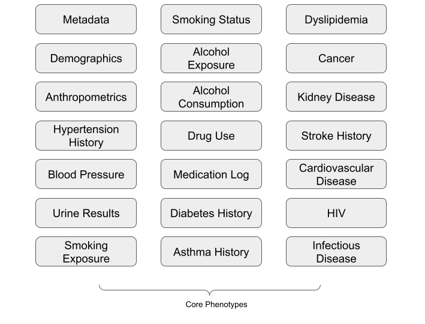

## Description

The H3Africa core phenotypes can be used to collect essential phenotypes related to African health and biomedical research. These phenotypes were prioritised based on the overlap in phenotype data collection across multiple research projects being conducted across the African continent, in various disease fields. Phenotypes include information related to a participant’s demographics, anthropometrics, tobacco and alcohol use, and disease history. The following document establishes guidelines (particularly applicable in Africa) on how to use the Core Phenotypes to collect detailed, relevant and harmonized phenotype and exposure data for research. 

## Phenotypes

Phenotype protocols contained in the toolkit are illustrated in the figure below:

## Administration

The phenotype protocols contained in the toolkit range from Interviewer/Self-administered questionnaires to clinically-administered and bioassay/lab-based assessments. The toolkit is applicable to human participants of all life stages, though some phenotype protocols are age-specific. For more information on administration of the toolkit, see the toolkit guideline.

## References

The toolkit consists of both existing and novel data collection standards, and was based on several existing resources. These resources are listed below:

1. AWI-Gen Collaborative Centre - Cardiometabolic Disease Research Protocols
2. Protocol - Blood Pressure (www.phenxtoolkit.org/protocols/view/40301)
3. Protocol - Cigarette Smoking Status (www.phenxtoolkit.org/protocols/view/30604)
4. Protocol - Tobacco - 30-Day Quantity and Frequency (www.phenxtoolkit.org/protocols/view/30804) 
5. Protocol - Alcohol - Lifetime Use (www.phenxtoolkit.org/protocols/view/30101) 
6. Protocol - Substances - 30-Day Frequency (www.phenxtoolkit.org/protocols/view/31302)
7. Protocol - Medication Inventory (www.phenxtoolkit.org/protocols/view/140301) 
8. Protocol - Personal History of Type I and Type II Diabetes (www.phenxtoolkit.org/protocols/view/140501) 
9. Protocol - Personal History of Kidney Failure (www.phenxtoolkit.org/protocols/view/140601) 
10. Protocol - Arrhythmia (www.phenxtoolkit.org/protocols/view/41101) 
11. Protocol - Rheumatic Fever/Rheumatic Heart Disease (www.phenxtoolkit.org/protocols/view/41401) 
12. Protocol - History of Stroke (www.phenxtoolkit.org/protocols/view/130301)