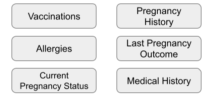

## Description

The General Medical History (GMH) toolkit can be used to collect essential phenotypes associated with GMH research, including: medical history related to allergies, pregnancy(ies), surgeries, vision and hearing disorders, mental disorders, respiratory system disorders, nervous system disorders, musculoskeletal system disorders, endocrine system disorders, digestive system disorders, cardiovascular system disorders, urogenital system disorders, circulatory system disorders, integumentary system disorders, sexually transmitted diseases, and developmental disorders. The following document establishes guidelines (particularly applicable in Africa) on how to use the toolkit and collect detailed, relevant and harmonized phenotype and exposure data for research. 

## Phenotypes

Phenotype protocols contained in the toolkit are illustrated in the figure below:

## Administration

The phenotype protocols contained in the toolkit are Interviewer/Self-administered questionnaires. The toolkit is applicable to human participants of all life stages, though some phenotype protocols are age-specific. For more information on administration of the toolkit, see the toolkit guideline.

## References

The toolkit consists of both existing and novel data collection standards, and was based on several existing resources. These resources are listed below:

1. Protocol - Immunizations (www.phenxtoolkit.org/protocols/view/161001)
