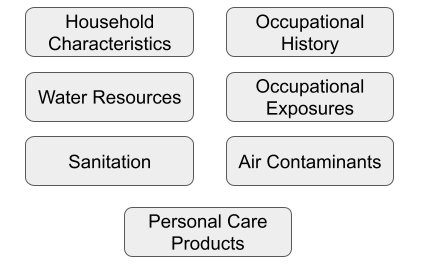

## Description

The Environmental Exposures toolkit can be used to collect information pertaining to: socio-economic status, occupational history, water resources and more. 

## Phenotypes

Phenotype protocols contained in the toolkit are illustrated in the figure below:

## Administration

The phenotype protocols contained in the toolkit range from Interviewer/Self-administered questionnaires to bioassay/lab-based assessments. The toolkit is applicable to human participants of all life stages, though some phenotype protocols are age-specific. For more information on administration of the toolkit, see the toolkit guideline.

## References

The toolkit consists of both existing and novel data collection standards, and was based on several existing resources. These resources are listed below:

1. H3Africa Case Report Form Instruments
2. Protocol - Occupation/Occupational History (www.phenxtoolkit.org/protocols/view/60501) 
3. Protocol - Air Contaminants in the Home Environment (www.phenxtoolkit.org/protocols/view/61101) 
4. Protocol - Personal Care Products (www.phenxtoolkit.org/protocols/view/61501) 
5. Protocol - Home and Workplace Exposures to Floor and Wall Materials (www.phenxtoolkit.org/protocols/view/61401) 
6. WHO Core questions on drinking water and sanitation for household surveys (www.who.int/water_sanitation_health/monitoring/household_surveys/en/) 
