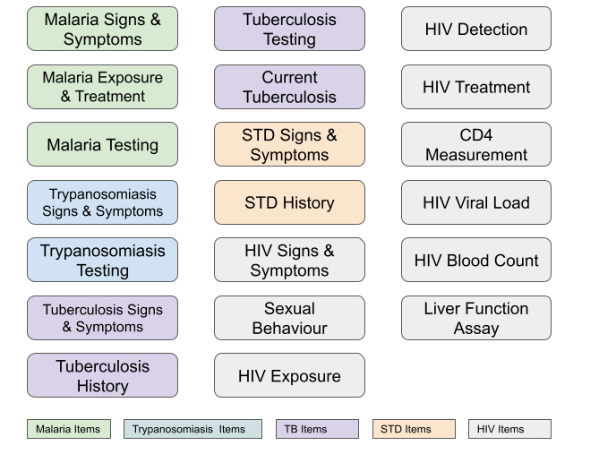

## Description

The Infectious Disease toolkit can be used to collect essential phenotypes associated with Infectious Disease related research, including information related to Malaria, Trypanosomiasis / Sleeping Sickness, Tuberculosis (TB) and HIV.

## Phenotypes

Phenotype protocols contained in the toolkit are illustrated in the figure below:

## Administration

The phenotype protocols contained in the toolkit range from Interviewer/Self-administered questionnaires to clinically-administered and bioassay/lab-based assessments. The toolkit is applicable to human participants of all life stages, though some phenotype protocols are age-specific. For more information on administration of the toolkit, see the toolkit guideline.

## References

The toolkit consists of both existing and novel data collection standards, and was based on several existing resources. These resources are listed below:

1. H3Africa Case Report Form Instruments
2. Sickle In Africa Core Data Elements (www.sickleinafrica.org/SIA_data_elements) 
3. Allie, T., Jackson, A., Ambler, J., Johnston, K., Du Bruyn, E., Schultz, C., Boloko, L., Wasserman, S., Davis, A., Meintjes, G., Wilkinson, R. J., & Tiffin, N. (2021). TBDBT: A TB DataBase Template for collection of harmonized TB clinical research data in REDCap, facilitating data standardisation for inter-study comparison and meta-analyses. PloS one, 16(3), e0249165. https://doi.org/10.1371/journal.pone.0249165 
4. Protocol - Sexual Risk Behavior - Male (www.phenxtoolkit.org/protocols/view/101701) 
5. Protocol - Sexual Risk Behavior - Female (www.phenxtoolkit.org/protocols/view/101702)
6. Enhanced COVID-19 Notifiable Medical Conditions (NMC) Notification Form (SA)
7. WHO Global COVID-19 Clinical Platform: Rapid core case report form
8. Protocol - Complete Blood Count (CBC) (www.phenxtoolkit.org/protocols/view/220501) 
9. Protocol - Liver Function - Assay (www.phenxtoolkit.org/protocols/view/190801) 
10. Protocol - Sexual Risk Behavior - Male (www.phenxtoolkit.org/protocols/view/101701)
11. Protocol - Sexual Risk Behavior - Female (www.phenxtoolkit.org/protocols/view/101702)
12. HIV Cohorts Data Exchange Protocol (https://hicdep.org/)
