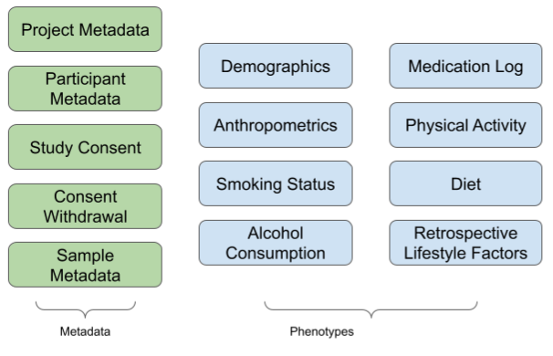

## Description

The Microbiome Research Data Toolkit is a multi-purpose toolkit which can be used to annotate microbiome research studies, for curation, proliferation and sharing, as well as prospectively standardise and retrospectively harmonise research participant-related information enrolled in microbiome studies and collaborations. 

## Content

Protocols contained in the Toolkit are illustrated in the figure below:

## References

The Toolkit consists of both existing and novel data collection standards, and was based on several existing resources. These resources are listed below:

1. Minimal Information about any Sequence Standard (MIxS)
2. MixS: MIMS (Metagenome or Environmental)
3. African Microbiome Portal Template
4. ENA Metadata Checklist
5. SRA Metadata Template

